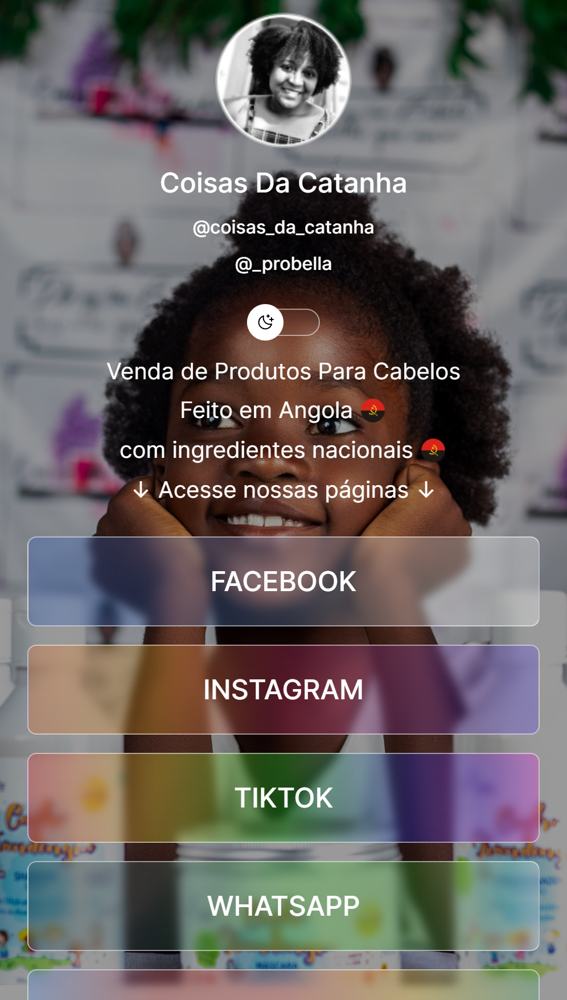

<h1 align="center">Coisas Da Catanha</h1>

  
Social Medias Links

  

# 🚀 Techs
> * HTML & CSS
> * JavaScript
> * Git & Github
> * Figma

# 💻 Project
Agregador de links para usar como cartão de visita.

# 🔖 Layout
Você pode visualizar o layout do projecto através [🔗DESTE LINK](https://www.figma.com/file/OiOGa0XRKdk3xWXmgLBQRA/DevLinks-(Community)?node-id=0%3A1&t=0ylDuS4ldhX45ZbE-1). E necessário ter conta no [Figma](https://figma.com) para acessá-lo.

### [🔗Clique aqui para acessar a página](https://inacio000.github.io/coisas-da-catanha/)
### Or scan the QR code bellow
#

  

